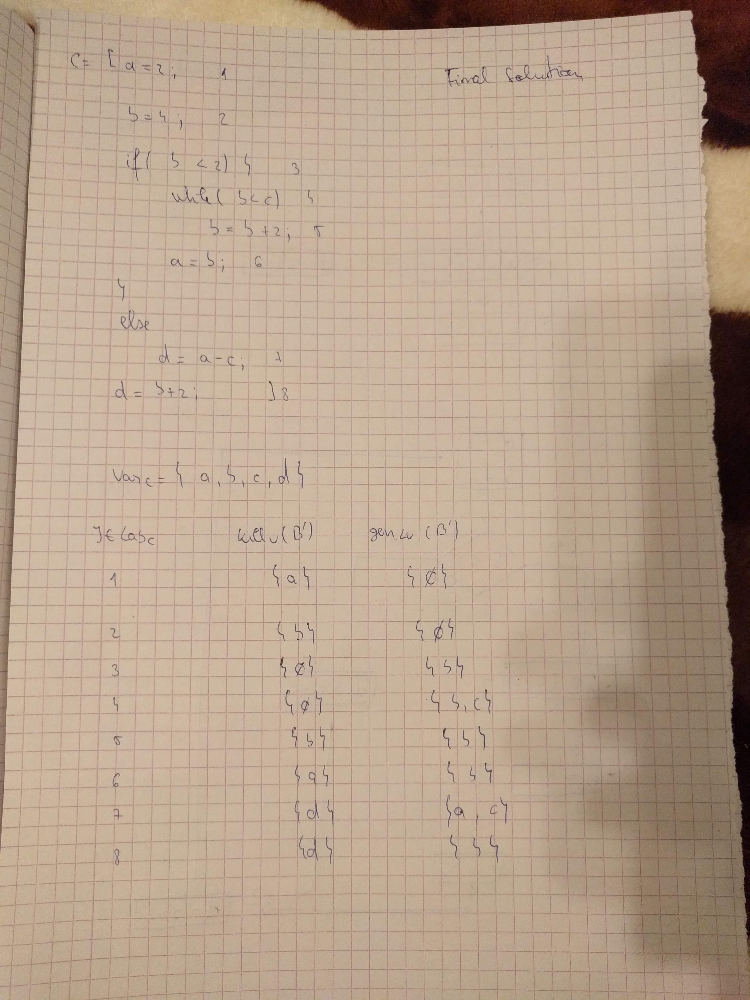
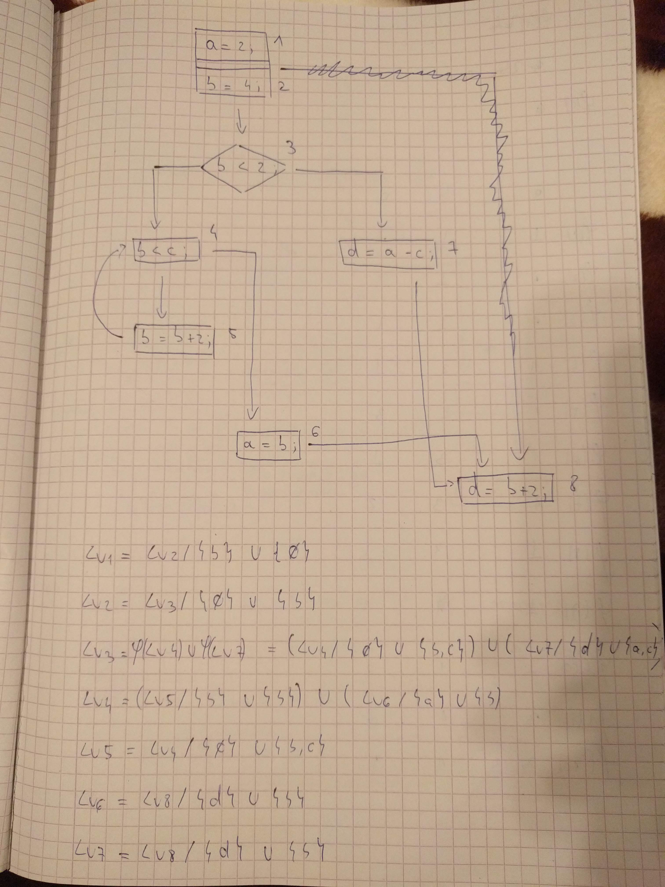
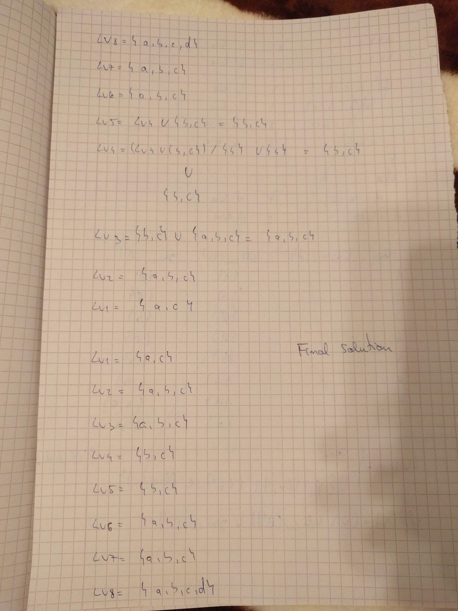
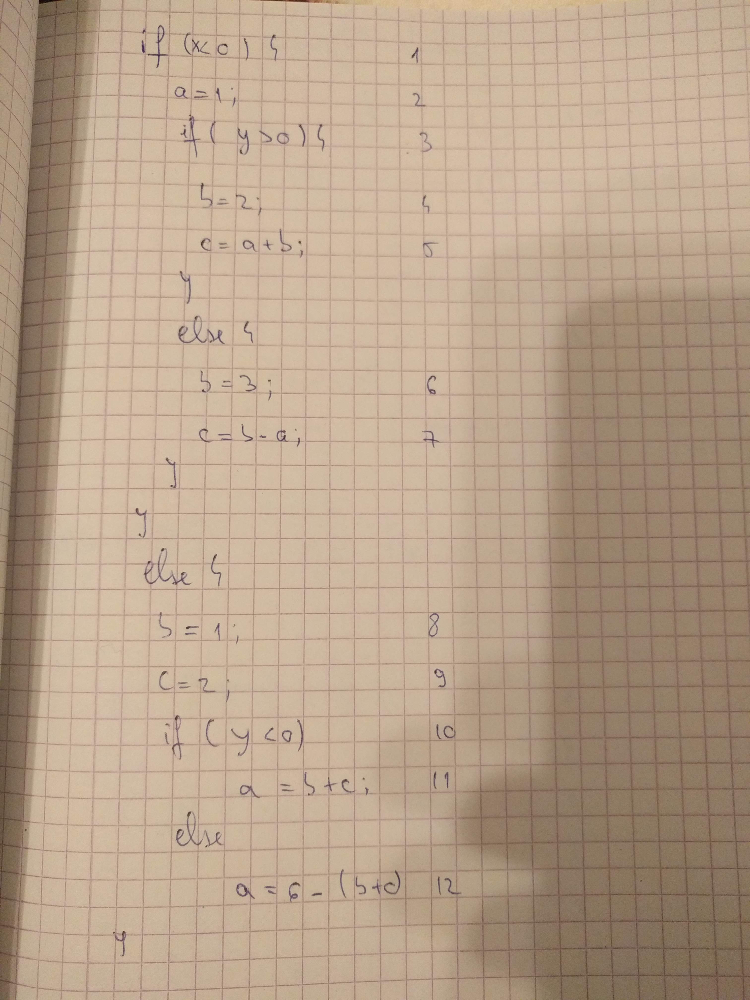
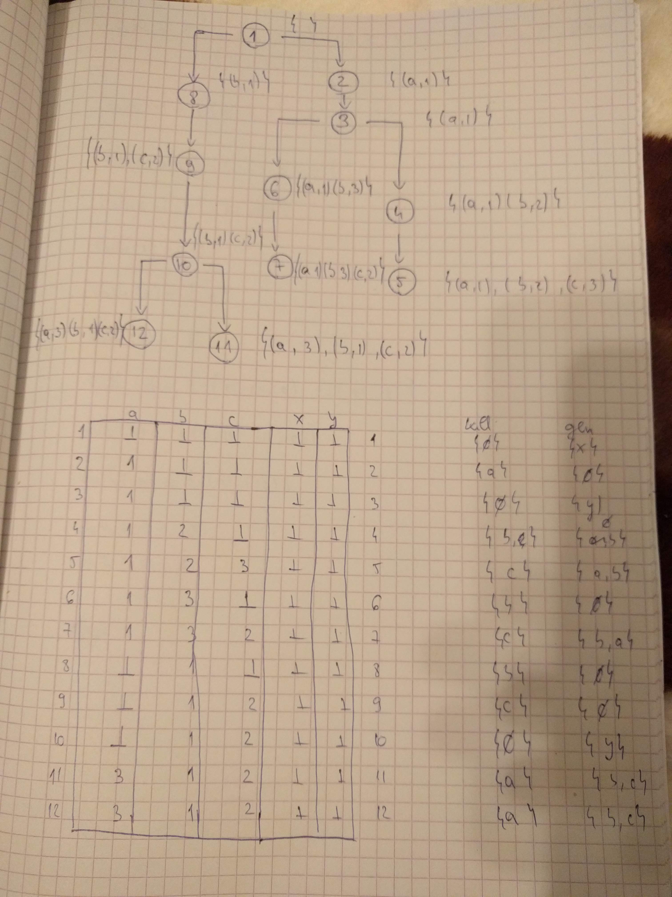
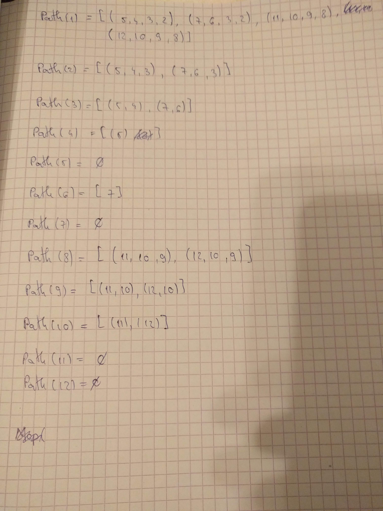
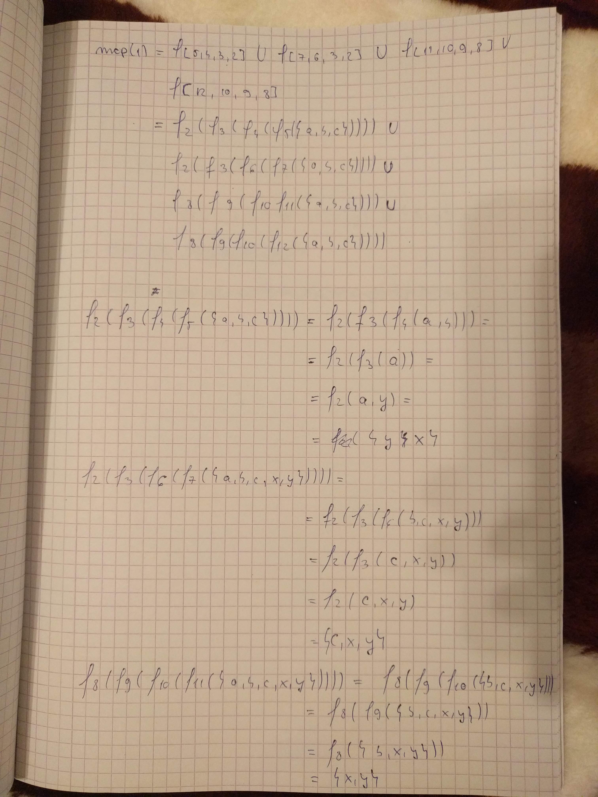
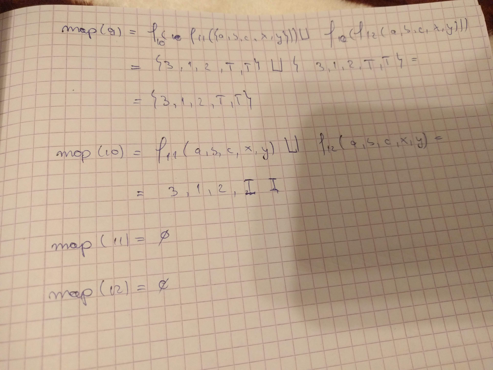
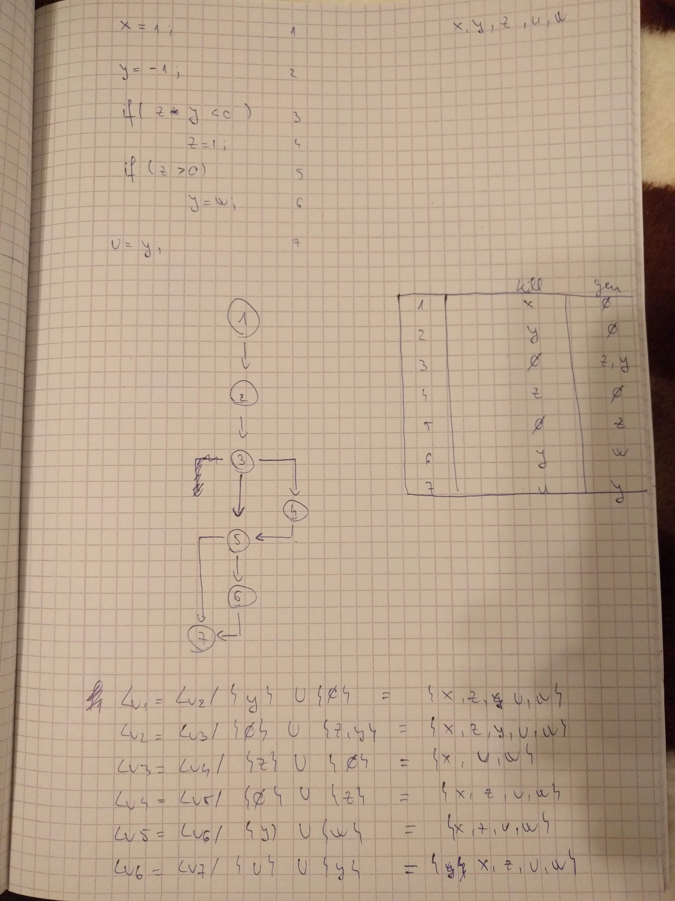

# Project 2 
### Buzdugan Alexandru MSD 2 

### Exercise 1
The goal is to do live variable analysis for the following program:
```c
1. a = 2;
2. b = 4;
3. if ( b < 2 ) {
4. while (b < c)
5. b = b + 2;
6. a = b;
}
else
7. d = a - c;
8. d = b + 2;
```
1. Build the control flow graph.
2. Define the functions kill and gen.
3. Define the transfer function.
4. Define the system of equations.
5. Apply the algorithm computing the fixed point (based on Knaster-Tarski Theorem).

- Step 1

    In this step we are labeling the commands, identifying the variables and defining the kill and gen functions.

    

- Step 2

    After that we are builduing the control graph, defining the transfer function and create the equation system.

    

- Step 3

   After defining the equation system we can apply the algorithm based on Knaster-Tarski to find the solution.

   

### Exercise 2

The goal is to do the constant propagation analysis on the follow-
ing program:

```c
1   if (x < 0)
    {
2       a = 1;
3       if (y > 0)
        {
4           b = 2;
5           c = a + b;
        }
        else
        {
6           b = 3;
7           c = b - a;
        }
    }
    else
    {
8       b = 1;
9       c = 2;
10      if (y < 0)
11          a = b + c;
        else
12          a = 6 - (b+c);
    }
```

1. Build the control flow graph.
2. Define the state.
3. Define the transfer function.
4. Apply the MOP algorithm.

The goal of constant propagation is to determine where in the program variables are guaranteed to have constant values. More specifically, the information computed for each CFG node n is a set of pairs, each of the form (variable, value). If we have the pair (x, v) at node n, that means that x is guaranteed to have value v whenever n is reached during program execution.

The MOP solution (for a forward problem) for each CFG node n is defined as follows:

For every path "enter → ... → n", compute the dataflow fact induced by that path (by applying the dataflow functions associated with the nodes on the path to the initial dataflow fact).
Combine the computed facts (using the combining operator, ⌈⌉ ).
The result is the MOP solution for node n.

It is worth noting that even the MOP solution can be overly conservative, because not all paths in the CFG are executable. For example, a program may include a predicate that always evaluates to false. Another way that non-executable paths can arise is when two predicates on the path are not independent.

- Step 1
    
    In the first step we are labeling the commands in the program.

    

- Step 2
    
    After that we build the flow graph and define the values of each instantiated variable for each step. This helps us to define the state easier. On the same page we define the state for each variable and define the kill and gen functions in case we will need them.

    I thought i might need them to calculate the transfer functions but i used the states instead.

    

- Step 3
   
    For each node we find the path from end to it.

    

- Step 4

    We start applying the mop for each path and obtaining the solution

    

- Step 5

    

- Step 6

    

### Exercise 3
Design a Uninitialized Variable Analysis that determines, at each
program point, whether a variable used at that point is not initialized. You may
use Constant Propagation Analysis as inspiration source.
1. Define the partial ordered set of the values for variables.
2. Define the analysis information domain (D, v) and describe how it can be
used to decide whether a variable used at a program point is not initialized.
3. Decide whether the analysis is forward or backward.
4. Define the transfer function.
5. Apply it (using the fixed point approach or the MOP approach) on the
following program:

```c
x = 1;
y = -1;
if (x * y < 0) z = 1;
if (z > 0) y = w;
u = y;
```

By following the live variable analysis for the final exercise I defined the labels, created CFG ,calculated the kill/gen functions and defined the transfer function.



Deciding if the analysis is forward or backard we have the following definitions:

- Forward problems (like constant propagation) where the information at a node n summarizes what can happen on paths from "enter" to n.
- Backward problems (like live-variable analysis), where the information at a node n summarizes what can happen on paths from n to "exit".

Looking at those we can deduce that an unitialized variable analysis is a forward problem because we want to go from end to the node where the variable is initialized. If we cannot find such node then our variable was not initialized.