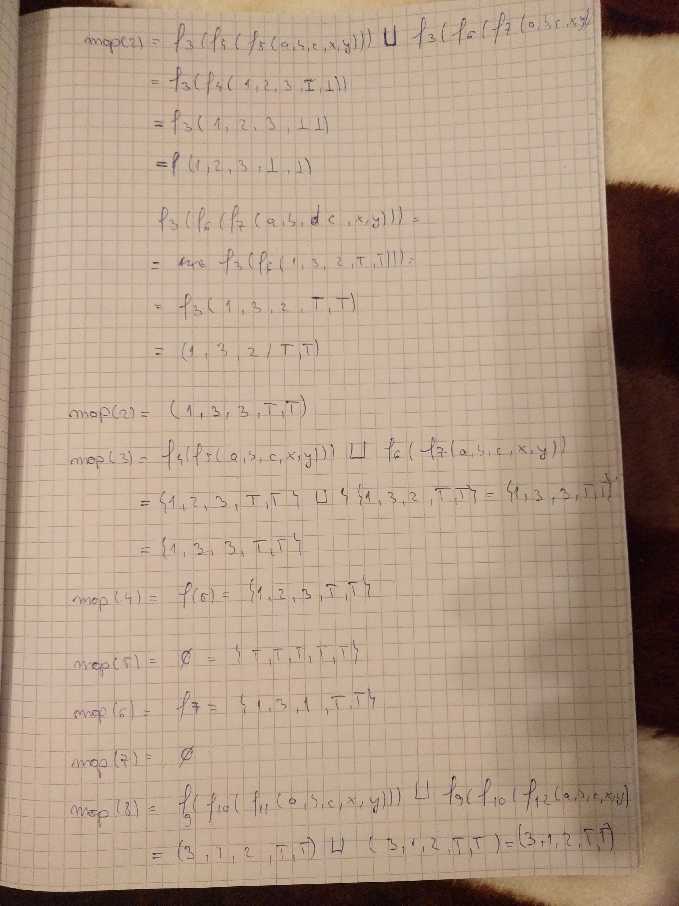

# Project 2 
### Buzdugan Alexandru MSD 2 

### Exercise 1

- Step 1

    

- Step 2

    

- Step 3
   
   

### Exercise 2

- Step 1

    

- Step 2

    

- Step 3
   
    

- Step 4

    

- Step 5

    

- Step 6

    

### Exercise 3

